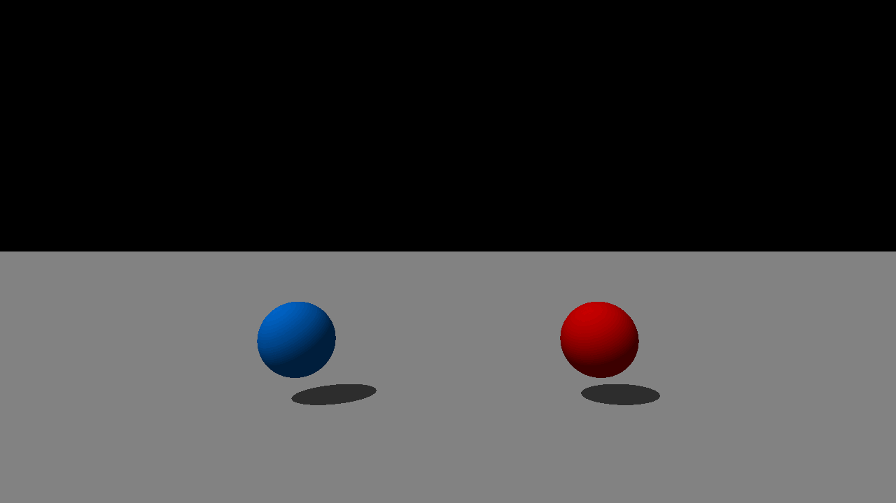

# Raytracer


## 🌟 Overview

The RayTracer is a 3D rendering engine that simulates the physical behavior of light to create photorealistic images. This project implements the ray tracing algorithm to generate renders of 3D scenes with complex visual effects.

<div align="center">
    
</div>

## 🔗 Resources

<div align="center">
  <a href="https://xmarano.github.io/RayTracer" style="text-decoration: none; display: inline-block; margin-right: 15px;">
    
  </a>
  <a href="https://raytracer.tektests.ovh" style="text-decoration: none; display: inline-block;">
    
  </a>
</div>

## ✨ Features

- **High-fidelity Rendering**
  - Physically accurate calculation of shadows, reflections, and refractions
  - Anti-aliasing for sharper images
  - Support for different output formats

- **Geometric Primitives**
  - Spheres, planes, cones, cylinders, and triangles
  - Precise positioning and rotation of objects
  - Extensible system for adding new shapes

- **Advanced Lighting System**
  - Ambient light for global illumination
  - Directional lights simulating the sun
  - Point lights for localized sources
  - Soft and hard shadows

- **Customizable Materials**
  - Color and texture properties
  - Ambient, diffuse, and specular coefficients
  - Configurable reflection and transparency

- **Modular Architecture**
  - Plugin system to extend functionality
  - Clear and documented programming interface
  - Easy addition of new materials and primitives

## 🛠️ Installation

### Prerequisites

**macOS**
```bash
brew install imagemagick
```

**Linux**
```bash
sudo apt-get install imagemagick
```

**RaspberryPi (Linux)**
```bash
sudo apt update
sudo apt install -y build-essential libsfml-dev libconfig++-dev imagemagick
```

### Compilation

```bash
make
```

## 🚀 Usage

### Rendering a Scene
```bash
./raytracer scenes/demo.cfg
```

### Creating Animations
```bash
python3.10 create_animation.py
```

## 📋 Configuration File Format

The RayTracer uses `.cfg` files to define scenes to render. Here is a simplified example:

```
camera: {
    position: {x: 0, y: 0, z: -10};
    rotation: {x: 0, y: 0, z: 0};
    fov: 90;
};

primitives: {
    spheres: (
        {
            position: {x: 0, y: 0, z: 0};
            radius: 1;
            material: {
                color: {r: 255, g: 0, b: 0};
                ambient: 0.2;
                diffuse: 0.8;
                specular: 1.0;
                reflection: 0.0;
            };
        }
    );
};

lights: {
    ambient: {intensity: 0.1};
    directional: (
        {
            direction: {x: 0, y: 1, z: -1};
            intensity: 0.5;
        }
    );
};
```

## 🖼️ Available Scenes

The project includes several predefined scenes that you can use to test the RayTracer:

- `scenes/easy.cfg`: Simple scene for beginners
- `scenes/test.cfg`: Test scene with multiple primitives
- `scenes/demo.cfg`: Demonstration of the engine's capabilities
- `scenes/artistic.cfg`: Artistic composition
- `scenes/space.cfg`: Space scene

## 🔌 Web Platform

The project also includes a web interface for testing the RayTracer online:

```bash
cd web
python app.py
```

Or visit directly [https://raytracer.tektests.ovh](https://raytracer.tektests.ovh)

## 📁 Project Structure

```
├── include/         # Headers and interfaces
├── src/             # Engine source code
├── plugins/         # Extensible primitives and materials
├── scenes/          # Scene configuration files
├── screenshots/     # Render screenshots
├── docs/            # Documentation generated by Doxygen
└── web/             # Web interface for testing the RayTracer
```

## 👨‍💻 Extending the RayTracer

To add new primitives or materials, implement the `IPrimitive` or `IMaterial` interfaces and place your plugins in the `plugins/` folder.


Project made by Epitech students. Here is a list of the contributors:

```bash
tom.clerc@epitech.eu
leo.gregori@epitech.eu
selim.bouasker@epitech.eu
enzo.cacciapuoti@epitech.eu
```
