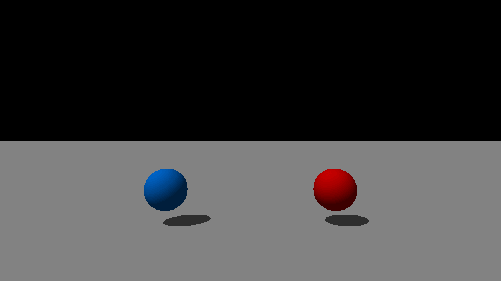

# Raytracer


<div align="center">
    
</div>

### Documentation 🫲 [`Website`](https://xmarano.github.io/RayTracer) 🫱

#### Requirements
MacOS
```
brew install imagemagick
```

Linux
```
sudo apt-get install imagemagick
```
temporary
```
sudo apt update
sudo apt install -y build-essential libsfml-dev libconfig++-dev imagemagick
```
